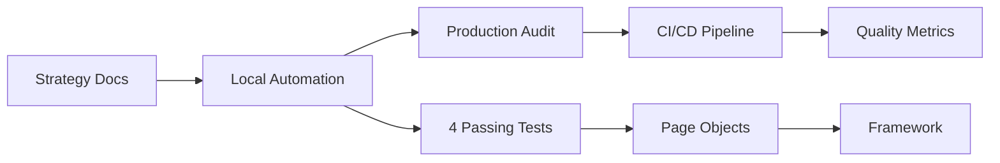

# 🧪 eCommerce Quality Lab: Hybrid QA Engineering Portfolio

## 🎯 Project Vision
This project demonstrates my approach to **full-cycle Quality Engineering** for e-commerce systems. It implements a **hybrid strategy**: starting with controlled testing in a local mock environment (nopCommerce) and extending to production-like audits (OpenCart demo).

**The goal is to showcase:** not just technical testing skills, but **product thinking, risk assessment, and engineering practices** that bridge development and business impact.

## 🚀 Current Status
**✅ Automation Framework is LIVE and WORKING!**
- 4 smoke tests passing successfully
- Local nopCommerce environment running via Docker
- Complete Page Object Model implementation
- Automated test execution via Maven

## 🏗️ Architecture & Strategy
### 🔹 Local Controlled Environment — nopCommerce
**Goal:** Show how to build a quality system from scratch.
- ✅ UI automation (Java + Selenium + TestNG)
- 📋 API validation (planned)
- 🗄️ DB checks (planned)
- 🔄 CI/CD regression (planned)

### 🔹 Production-like Environment — OpenCart Demo
**Goal:** Show how to test a real product.
- 🔍 Exploratory testing
- 🎨 UX & usability analysis
- ⚠️ Risk-based testing
- 📊 Business impact assessment

## 🧪 What's Already Tested

### ✅ Smoke Tests (4 tests)
1. Home page title verification
2. Logo display check
3. Search box existence
4. Navigation links verification

### ✅ Critical Flow Tests
1. **Complete purchase flow:** Search → Add to Cart → Verify Cart
2. **User authentication:** Login/Logout
3. **Search functionality:** Existing and non-existing products

## 📁 Project Structure
```
ecommerce-quality-lab/
├── 01-qa-strategy/
│   ├── quality-vision.md
│   ├── risk-based-testing.md
│   ├── test-pyramid.md
│   └── test-strategy-executive-summary.md
│
├── 02-local-mock-nopcommerce/
│   ├── docker-compose.yml
│   ├── ui-automation/
│   │   ├── pom.xml
│   │   ├── testng.xml
│   │   ├── src/main/java/com/ecommerce/qa/
│   │   │   ├── components/
│   │   │   │   └── HeaderComponent.java
│   │   │   ├── framework/
│   │   │   │   └── BaseTest.java
│   │   │   └── pages/
│   │   │       ├── HomePage.java
│   │   │       ├── LoginPage.java
│   │   │       ├── ProductPage.java
│   │   │       └── CartPage.java
│   │   └── src/test/java/com/ecommerce/qa/tests/
│   │       ├── SmokeTest.java
│   │       └── CriticalFlowTest.java
│   ├── api-tests/          # 📋 Planned
│   ├── db-validation/      # 📋 Planned
│   └── test-data/          # 📋 Planned
│
├── 03-production-audit-opencart/  # 📋 Planned
│   ├── exploratory-testing/
│   ├── ux-usability-findings/
│   └── bug-reports/
│
├── .github/         # 🏗️ In Progress
│   ├── .github.iml
│   ├── modules.xml
│   ├── workspace.xml
│   └── misc.xml      
├── .gitignore
└── README.md
```

## 🛠️ Tech Stack
| Category | Tools & Technologies |
|----------|---------------------|
| **Automation** | Java 17+, Selenium WebDriver 4.15, TestNG 7.8, Maven, Page Object Model |
| **Driver Management** | WebDriverManager 5.6.3 (automatic) |
| **Local Environment** | Docker, Docker Compose, nopCommerce, SQL Server |
| **CI/CD** | GitHub Actions (planned), Allure Reports (planned) |
| **Methodologies** | Risk-Based Testing, Shift-Left, Exploratory Testing, Agile |

## 🚀 Quick Start
### 1️⃣ Clone Repository
```bash
git clone https://github.com/Andreeva12/ecommerce-quality-lab.git
cd ecommerce-quality-lab
```

### 2️⃣ Start Local nopCommerce
```bash
cd 02-local-mock-nopcommerce
docker-compose up -d
```
Wait 1-2 minutes
Access: http://localhost:8080
Admin: admin@qa-lab.com / QaLab_2025!

3️⃣ Run Automation Tests
```bash
cd 02-local-mock-nopcommerce
cd ui-automation
mvn clean test                 # Run all tests
mvn test -Dtest=SmokeTest      # Run only smoke tests
mvn test -Dtest=CriticalFlowTest # Run only critical flow tests

```
1.Test results: target/surefire-reports/
2.Screenshots on failure: screenshots/

## 📁 Project Structure
```
ecommerce-quality-lab/
├── 01-qa-strategy/          # QA strategy documentation
├── 02-local-mock-nopcommerce/ # nopCommerce automation
├── 03-production-audit-opencart/ # OpenCart manual testing
├── .github/workflows/       # GitHub Actions
└── screenshots/             # Screenshots on test failure
```

## 📈 Key Principles Demonstrated
- **Hybrid Testing Approach:** Combining precise automated checks with exploratory manual testing
- **Risk-Based Prioritization:** Focusing effort on high-impact business scenarios
- **Engineering Mindset:** Building maintainable, version-controlled test assets
- **Business Alignment:** Connecting test scenarios to real user journeys and metrics

## 📬 Connect & Feedback
This is a living portfolio project. Feel free to explore, raise issues, or connect for discussion via [LinkedIn](https://www.linkedin.com/in/katsiaryna-malashchytskaya-741a40300).

## 🚀 Quick Start

### 1. Prerequisites
Ensure you have the following installed:
- Java 11+
- Maven 3.6+
- Docker & Docker Compose
- Git

### 2. Clone and Setup
```bash
git clone https://github.com/Andreeva12/ecommerce-quality-lab.git
cd ecommerce-quality-lab
```

### 3. Start Local nopCommerce
```bash
cd 02-local-mock-nopcommerce
docker-compose up -d

# Wait for nopCommerce to start (1-2 minutes)
# Access at: http://localhost:8080
# Admin: admin@qa-lab.com / QaLab_2025!
```

### 4. Run Automation Tests
```bash
cd 02-local-mock-nopcommerce/ui-automation
mvn clean test
```

### 5. Expected Output
```
✅ Home page title test passed!
✅ Logo test passed!
✅ Link found: Register
✅ Link found: Log in
✅ Link found: Shopping cart
✅ Link found: Wishlist
✅ Search box test passed!
Tests run: 4, Failures: 0, Errors: 0, Skipped: 0
```

## 📈 Key Principles Demonstrated

**Hybrid Testing Approach:** Combining precise automated checks with exploratory manual testing

**Risk-Based Prioritization:** Focusing effort on high-impact business scenarios

**Engineering Mindset:** Building maintainable, version-controlled test assets

**Business Alignment:** Connecting test scenarios to real user journeys and metrics

**Infrastructure as Code:** Dockerized environment for consistent testing

## 🔄 Development Workflow



## 📊 Next Steps

### Immediate (Week 1):
- [x] Basic automation framework
- [ ] Add Allure reporting
- [ ] Implement API tests

### Short-term (Week 2):
- [ ] Complete checkout flow automation
- [ ] Add database validation
- [ ] Start OpenCart exploratory testing

### Long-term (Week 3-4):
- [ ] CI/CD pipeline with GitHub Actions
- [ ] Performance testing integration
- [ ] Comprehensive test reporting dashboard

## 🐛 Issue Reporting & Contribution

Found an issue or have suggestions? Please:

1. Check existing issues
2. Create a new issue with detailed description
3. Follow the project structure for contributions

## 👩‍💻 Author

**Andreeva12** - QA Engineer & Test Automation Specialist

- Project: [eCommerce Quality Lab](https://github.com/Andreeva12/ecommerce-quality-lab)

## 📬 Connect & Feedback

This is a living portfolio project. Feel free to:

- ⭐ Star the repo if you find it useful
- 🐛 Report issues or suggest improvements
- 🔄 Fork and adapt for your own projects
- 💬 Connect for discussion via GitHub Issues

---

*Last Updated: January 2026 | Status: Automation Framework ✅ Working*
---
*"Quality is not an act, it is a habit." — Aristotle*
